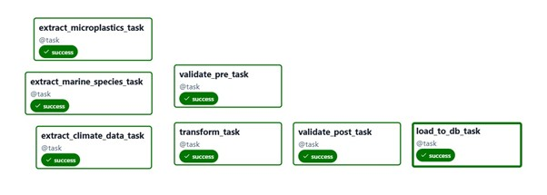
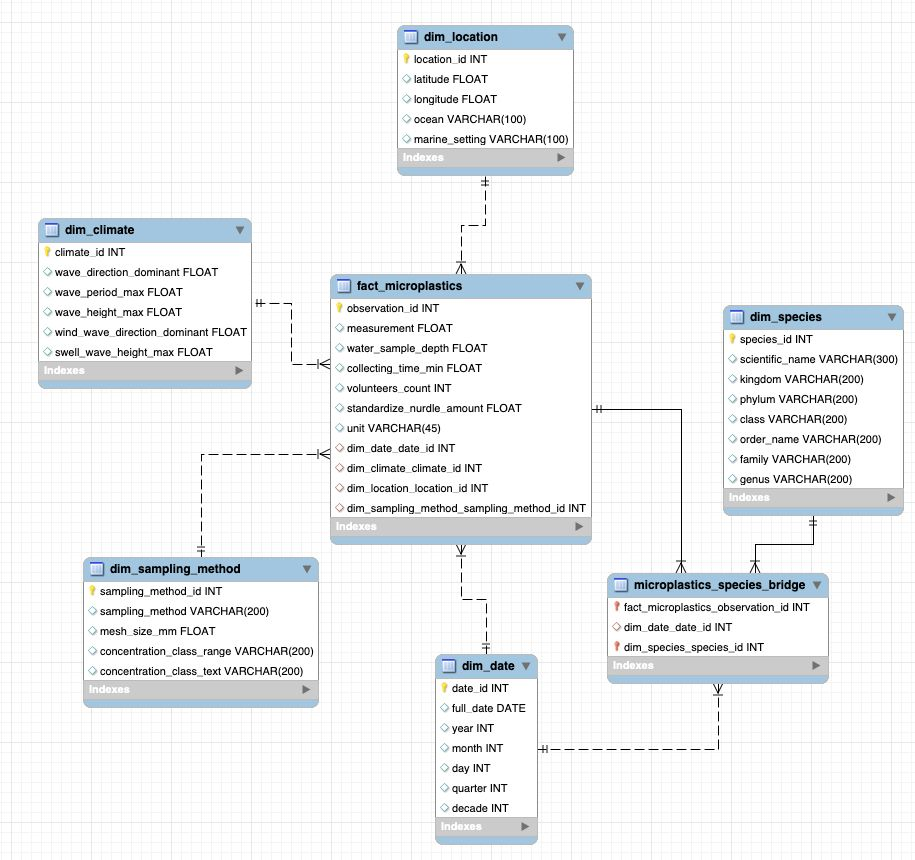

# 🌊 ODS14 – Marine Data ETL Pipeline


---

## Project Overview

This project implements an **automated ETL (Extract–Transform–Load) pipeline** aligned with **UN Sustainable Development Goal 14 (Life Below Water)**.
The pipeline integrates environmental and biodiversity data — **marine species**, **microplastic pollution**, and **ocean climate variables** — to support monitoring and analysis of **marine ecosystem health** in **North America**.

Built with **Apache Airflow**, **Great Expectations**, **Pandas**, and **Dash**, the solution automates data ingestion, quality validation, consolidation, and visualization through a star-schema Data Warehouse.

---

## Refined Objectives

### Main Objective

Automate the ingestion, validation, cleaning, and integration of marine environmental data to produce a unified, validated dataset that supports monitoring, trend detection, and decision-making on marine conservation.

### Technical Objectives

- Orchestrate multi-source extractions (microplastics DB, marine species CSV, Open-Meteo API) using **Airflow DAGs**.
- Apply **data quality validation** via **Great Expectations** at both pre- and post-transformation stages.
- Filter data geospatially to **North America** and unify by date and coordinates.
- Store validated results in a **MySQL star-schema Data Warehouse**.
- Automate report generation and ensure traceability of each pipeline run.

### Analytical Objectives

- Compute environmental KPIs (average & maximum microplastic concentration, species richness, climate indicators).
- Identify **critical coastal zones** with high pollution and low biodiversity.
- Explore correlations between **pollution, climate, and biodiversity**.

---

## ETL Pipeline Architecture

<p align="center">
  
</p>

**Pipeline flow:**

1. **Extract** – Pulls data from three sources:
   - MySQL database (`microplastics_db`)
   - CSV dataset (`marine_species.csv`)
   - Public API (**Open-Meteo**) for oceanic climate metrics
2. **Pre-Data Quality** – Runs initial validations with Great Expectations.
3. **Transform & Merge** – Cleans, standardizes, filters North American coordinates, and merges by spatial grid and date proximity.
4. **Post-Data Quality** – Re-validates merged data and generates an Excel summary report.
5. **Load** – Inserts clean data into a MySQL **star schema** (`marineDB`).
6. **Visualization** – Dash dashboard displays KPIs and interactive insights.

---

## Airflow DAG Design

<p align="center">
  
</p>

**DAG ID:** `etl_ods14_marine_life`
**Schedule:** Daily (`@daily`)
**Catchup:** Disabled (`False`)

**Task flow:**

| Step | Task ID                         | Description                                                |
| ---- | ------------------------------- | ---------------------------------------------------------- |
| 1    | `extract_microplastics_task`  | Extracts microplastics data from MySQL.                    |
| 2    | `extract_marine_species_task` | Loads and samples the marine species dataset.              |
| 3    | `extract_climate_data_task`   | Queries historical marine climate data via Open-Meteo API. |
| 4    | `validate_pre_task`           | Performs pre-transformation data quality checks.           |
| 5    | `transform_task`              | Cleans, filters, grids, and merges datasets.               |
| 6    | `validate_post_task`          | Applies post-merge Great Expectations validation.          |
| 7    | `load_to_db_task`             | Loads validated data into the MySQL Data Warehouse.        |

---

## Data Extraction

**Sources:**

- **Microplastics:** MySQL table `microplastics` (measurement, sampling method, mesh size, etc.).
- **Marine Species:** CSV data from GBIF (taxonomy, coordinates, event date).
- **Ocean Climate:** REST API (`https://marine-api.open-meteo.com/v1/marine`) — provides daily ocean variables such as:
  - Wave height, direction, and period
  - Wind-wave and swell metrics
  - Sea surface temperature

Each extraction module saves CSV outputs into `/opt/airflow/data/` for subsequent stages.

---

## Data Quality Validation (Great Expectations)

Automated validation ensures **data integrity and reliability** before and after transformation.

- **Library:** Great Expectations (`dataqualitycheck.py`)
- **Validation stages:**
  - *Pre-Data Quality:* checks for nulls, coordinate ranges, duplicates, and unit consistency.
  - *Post-Data Quality:* re-evaluates integrity of merged data (domain & range rules).
- **Output:** summarized **Excel reports** combining all validation results.

**Examples of expectations:**

- Non-null values for key columns (`date`, `latitude`, `longitude`).
- Latitude ∈ [5, 83], Longitude ∈ [−180, −50].
- DOI patterns valid (`^10\.\d{4,9}/[-._;()/:A-Za-z0-9]+$`).
- Unique compound keys (`objectid + date`).
- Units within allowed set (`items/m3`, `items/l`, `items/km2`).

---

## Transformation & Merge

Performed by [`transform.py`](scripts/transform.py):

1. **Normalization** – Standardizes column names and data types across all sources.
2. **Filtering** – Keeps only records within the **North American geographic bounds**.
3. **Grid creation** – Groups nearby coordinates into 3°×3° spatial cells.
4. **Merging** –
   - `microplastics` + `climate`: `merge_asof` (nearest date within 60-day tolerance).
   - Adds aggregated species taxonomy by grid cell.
5. **Output:**
   - Clean datasets (`microplastics_clean.csv`, `marine_species_clean.csv`, `climate_clean.csv`)
   - Unified dataset `merged_marine_data.csv`

---

## Star Schema Design

<p align="center">
  
</p>

**Database:** `marineDB`
Designed for fast analytical queries and flexible slicing by dimension.

| Table                            | Type      | Description                                                                   |
| -------------------------------- | --------- | ----------------------------------------------------------------------------- |
| `fact_microplastics`           | Fact      | Main table containing microplastic measurements and related dimension keys.   |
| `dim_date`                     | Dimension | Temporal context (date, month, year, quarter, decade).                        |
| `dim_location`                 | Dimension | Geographic info (latitude, longitude, ocean, setting).                        |
| `dim_climate`                  | Dimension | Ocean climate attributes (wave height, period, direction).                    |
| `dim_sampling_method`          | Dimension | Details about sampling methodology and mesh size.                             |
| `dim_species`                  | Dimension | Taxonomic attributes (kingdom, phylum, class, order, family, genus, species). |
| `microplastics_species_bridge` | Bridge    | Links facts with associated species per date.                                 |

---

## Dashboard Overview

**Technology:** [Dash (Plotly)](https://dash.plotly.com/)
**File:** `visualizations/dashboard.py`
**Execution:** runs locally and connects directly to `marineDB`.

**Features:**

- KPI cards: total records, locations, species richness, mean measurement.
- Tabs:
  - Summary Overview
  - Geographical distribution (map)
  - Temporal trends
  - Sampling methods
  - Raw data viewer

---

## How to Run Locally

### 1. Clone the repository

```bash
git clone https://github.com/HEstefaniaR/ods14-Marine-ETL-2.git
cd ods14-Marine-ETL-2
```

### 2. Create and activate a virtual environment

```bash
python -m venv venv
source venv/bin/activate      # on Linux/Mac
venv\Scripts\activate         # on Windows
```

### 3. Install dependencies

```bash
pip install -r requirements.txt
```

### 4. Start MySQL and Airflow

Ensure MySQL is running and accessible (default: `host.docker.internal:3306`).

Edit the scripts/load.py, visualizations/dashboardy.py and init/init-sql.py files and update credentials if needed:

```
USER = "root"
PASSWORD = "root"
HOST = "localhost"
PORT = 3306
```

And run:

```
python init/init-sql.py
```

Run Docker Compose:

```bash
docker compose up -d
```

### 5. Launch the Dashboard

```bash
python visualizations/dashboard.py
```

Access locally at: [http://localhost:8050](http://localhost:8050)

---

## Tools & Technologies

| Layer          | Technology                                | Purpose                           |
| -------------- | ----------------------------------------- | --------------------------------- |
| Orchestration  | Apache Airflow                            | Automates ETL workflow            |
| Extraction     | Python (Pandas, Requests, Open-Meteo API) | Reads raw data from DB, CSV, API  |
| Transformation | Pandas, NumPy                             | Cleansing, normalization, merging |
| Validation     | Great Expectations                        | Data quality assurance            |
| Storage        | MySQL                                     | Dimensional Data Warehouse        |
| Visualization  | Dash (Plotly)                             | Interactive dashboard             |
| Environment    | Docker Compose                            | Containerized Airflow setup       |

---

## 📁 Repository Structure

```bash
ODS14-MARINE-ETL-2/
├── airflow/
│   ├── config/airflow.cfg
│   └── dags/dag_etl_pipeline.py
├── init/init-sql.py
├── scripts/
│   ├── extract.py
│   ├── transform.py
│   ├── load.py
│   ├── dataqualitycheck.py
│   └── __init__.py
├── visualizations/dashboard.py
├── images/
│   ├── etl_pipeline.png
│   ├── dag_diagram.jpg
│   └── star_schema.jpg
├── EDA.ipynb
├── docker-compose.yaml
├── requirements.txt
└── README.md
```

---

## Authors

**Natalia Paredes Cambindo**, **Estefanía Hernández Rojas**, **Fabián Gomezcasseres**
_Universidad Autónoma de Occidente_
Teacher: **Breyner Posso Bautista**
