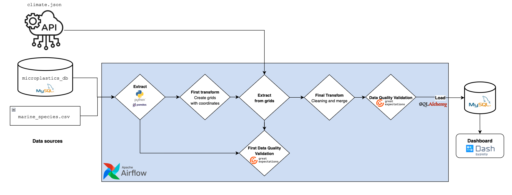

# 🌊 ODS14 – Marine Data ETL Pipeline


---

## Project Overview

This project implements an **automated ETL (Extract–Transform–Load) pipeline** aligned with **UN Sustainable Development Goal 14 (Life Below Water)**.
The pipeline integrates environmental and biodiversity data — **marine species**, **microplastic pollution**, and **ocean climate variables** — to support monitoring and analysis of **marine ecosystem health** in **North America**.

Built with **Apache Airflow**, **Great Expectations**, **Pandas**, and **Dash**, the solution automates data ingestion, quality validation, consolidation, and visualization through a star-schema Data Warehouse.

---

## Refined Objectives

### Main Objective

Automate the ingestion, validation, cleaning, and integration of marine environmental data to produce a unified, validated dataset that supports monitoring, trend detection, and decision-making on marine conservation.

### Technical Objectives

- Orchestrate multi-source extractions (microplastics DB, marine species CSV, Open-Meteo API) using **Airflow DAGs**.
- Apply **data quality validation** via **Great Expectations** at both pre- and post-transformation stages.
- Filter data geospatially to **North America** and unify by date and coordinates.
- Store validated results in a **MySQL star-schema Data Warehouse**.
- Automate report generation and ensure traceability of each pipeline run.

### Analytical Objectives

- Compute environmental KPIs (average & maximum microplastic concentration, species richness, climate indicators).
- Identify **critical coastal zones** with high pollution and low biodiversity.
- Explore correlations between **pollution, climate, and biodiversity**.

---

## ETL Pipeline Architecture

<p align="center">
  
</p>

**Pipeline flow:**
1. Extract: Retrieves raw data from multiple sources: Microplastics and marine species datasets
2.	First Transform (Grid Generation): Cleans and standardizes the raw datasets, then generates spatial grid references combining species and microplastic data. These grids define the coordinates used to request detailed climate records.
3.	Climate Extraction: Oceanic climate data from the Open-Meteo API, based on generated grid coordinates. Uses the generated grids to download historical oceanic climate data (e.g., temperature, wind, and wave metrics) for each location.
4.	Pre-Data Quality Check: Runs Great Expectations validations on the extracted data to ensure schema consistency, data completeness, and valid value ranges.
5.	Final Transform (Integration): Combines microplastics, biodiversity, and climate datasets into a unified structure, aligning by spatial and temporal proximity. Outputs multiple processed files, including the final merged dataset.
6.	Post-Data Quality Check: Re-runs Great Expectations to verify data integrity after transformation, generating both Excel and CSV quality reports.
7.	Load: Loads the validated dataset into a MySQL star schema (marineDB) for analytical queries and visualization.
8.	Visualization: The Dash dashboard presents environmental KPIs such as record counts, species diversity, microplastic levels, and average wave height.
  
---

## Airflow DAG Design

<p align="center">
  
</p>

**DAG ID:** `etl_ods14_marine_life`
**Schedule:** Daily (`@daily`)
**Catchup:** Disabled (`False`)

**Task flow:**

| Step | Task ID                            | Description                                                                 |
| ---- | ---------------------------------- | --------------------------------------------------------------------------- |
| 1    | `extract_microplastics_task`       | Extracts microplastics data from the MySQL source and saves it as CSV.      |
| 2    | `extract_marine_species_task`      | Downloads and samples marine species data from GBIF.                        |
| 3    | `transform_first_pass_task`        | Generates initial spatial grids (`grids_catalog.csv`) for climate extraction. |
| 4    | `extract_climate_from_grids_task`  | Retrieves historical ocean climate data from Open-Meteo API using grid cells. |
| 5    | `validate_pre_task`                | Runs pre-transformation Great Expectations validation on raw datasets.      |
| 6    | `transform_final_task`             | Performs full data transformation, merging climate, species, and microplastics. |
| 7    | `validate_post_task`               | Applies post-merge data validation ensuring integrity and consistency.       |
| 8    | `load_to_db_task`                  | Loads the final validated dataset into the MySQL Data Warehouse.             |
---

## Data Extraction

**Sources:**

- **Microplastics:** MySQL table `microplastics` (measurement, sampling method, mesh size, etc.).
- **Marine Species:** CSV data from GBIF (taxonomy, coordinates, event date).
- **Ocean Climate:** REST API (`https://marine-api.open-meteo.com/v1/marine`) — provides daily ocean variables such as:
  - Wave height, direction, and period
  - Wind-wave and swell metrics
  - Sea surface temperature

Each extraction module saves CSV outputs into `/opt/airflow/data/` for subsequent stages.

---

## Data Quality Validation (Great Expectations)

Automated validation ensures **data integrity and reliability** before and after transformation.

- **Library:** Great Expectations (`dataqualitycheck.py`)
- **Validation stages:**
  - *Pre-Data Quality:* checks for nulls, coordinate ranges, duplicates, and unit consistency.
  - *Post-Data Quality:* re-evaluates integrity of merged data (domain & range rules).
- **Output:** summarized **Excel reports** combining all validation results.

---

## Transformation & Merge

Performed by [`transform.py`](scripts/transform.py):

1. **Normalization** – Standardizes column names and data types across all sources.
2. **Filtering** – Keeps only records within the **North American geographic bounds**.
3. **Grid creation** – Groups nearby coordinates into 3°×3° spatial cells.
4. **Merging** –
   - `microplastics` + `climate`: `merge_asof` (nearest date within 60-day tolerance).
   - Adds aggregated species taxonomy by grid cell.
5. **Output:**
   - Clean datasets (`microplastics_clean.csv`, `marine_species_clean.csv`, `climate_clean.csv`)
   - Unified dataset `merged_marine_data.csv`

---

## Star Schema Design

<p align="center">
  
</p>

**Database:** `marineDB`
Designed for fast analytical queries and flexible slicing by dimension.

| Table                            | Type      | Description                                                                                           |
| -------------------------------- | --------- | ----------------------------------------------------------------------------------------------------- |
| `fact_microplastics`             | **Fact**  | Central table storing microplastic measurements linked to time, location, climate, and sampling method. |
| `dim_date`                       | Dimension | Provides temporal context (date, year, month, day, quarter, decade).                                  |
| `dim_location`                   | Dimension | Geographic reference (latitude, longitude, ocean, and marine setting).                               |
| `dim_climate`                    | Dimension | Captures marine climate indicators: wave height, period, direction, wind-wave, and swell parameters.  |
| `dim_sampling_method`            | Dimension | Details the sampling methodology, concentration class, and mesh-related metadata.                     |
| `dim_species`                    | Dimension | Stores taxonomic hierarchy: kingdom, phylum, class, order, family, genus, and scientific name.        |
| `microplastics_species_bridge`   | Bridge    | Many-to-many relationship linking microplastic observations to associated species by date.             |


---

## Dashboard Overview

**Technology:** [Dash (Plotly)](https://dash.plotly.com/)
**File:** `visualizations/dashboard.py`
**Execution:** runs locally and connects directly to `marineDB`.

Features:

- KPI Cards: total microplastic records, locations, species richness, climate records, and average concentration.
Tabs:

- Summary Overview: global view of microplastic pollution and climate trends.
- Critical Zones: interactive map showing contamination hotspots.
- Temporal Trends: time-series analysis of microplastic levels, biodiversity, and ocean conditions.
- Biodiversity: taxonomic diversity and species exposure to microplastics.
- Climate & Correlations: relationships between ocean climate variables and pollution levels.
- Sampling Methods: comparison of collection techniques and concentration variability.
  
---

How to Run Locally

1. Clone the repository

```
git clone https://github.com/HEstefaniaR/ods14-Marine-ETL-2.git
cd ods14-Marine-ETL-2
```

2. Download the data (required)

Download the raw datasets from the following link: [data_raw](https://drive.google.com/drive/folders/1kI5Ygzks55naB40aIRATPcKPhOcrlKvT?usp=sharing)

After downloading, place all files inside: `/data/data_raw/`.

**Important**: The ETL pipeline and dashboard require these files to be present in data/data_raw before running any extraction or transformation scripts.

3. Create and activate a virtual environment

```
python -m venv venv
source venv/bin/activate      # on Linux/Mac
venv\Scripts\activate         # on Windows
```

4. Install dependencies

```
pip install -r requirements.txt
```

5. Start MySQL and Airflow

Ensure MySQL is running and accessible (default: host.docker.internal:3306).

Edit the following files to update credentials if needed:
	•	scripts/load.py
	•	visualizations/dashboard.py
	•	init/init-sql.py

```
USER = "root"
PASSWORD = "root"
HOST = "localhost"
PORT = 3306
```

Then initialize the database schema:

```
python init/init-sql.py
```

Start Airflow and supporting services:

```
docker compose up -d
```

6. Launch the Dashboard

```
python visualizations/dashboard.py
```

Access the dashboard locally at: [http://localhost:8050](http://localhost:8050)

---

## Tools & Technologies

| Layer          | Technology                                | Purpose                           |
| -------------- | ----------------------------------------- | --------------------------------- |
| Orchestration  | Apache Airflow                            | Automates ETL workflow            |
| Extraction     | Python (Pandas, Requests, Open-Meteo API) | Reads raw data from DB, CSV, API  |
| Transformation | Pandas, NumPy                             | Cleansing, normalization, merging |
| Validation     | Great Expectations                        | Data quality assurance            |
| Storage        | MySQL                                     | Dimensional Data Warehouse        |
| Visualization  | Dash (Plotly)                             | Interactive dashboard             |
| Environment    | Docker Compose                            | Containerized Airflow setup       |

---

## Repository Structure

```bash
ODS14-MARINE-ETL-2/
├── airflow/
│   ├── config/airflow.cfg
│   └── dags/dag_etl_pipeline.py
├── init/init-sql.py
├── scripts/
│   ├── extract.py
│   ├── transform.py
│   ├── load.py
│   ├── dataqualitycheck.py
│   └── __init__.py
├── visualizations/dashboard.py
├── diagrams/
├── EDA.ipynb
├── docker-compose.yaml
├── requirements.txt
└── README.md
```

---

## Authors

**Natalia Paredes Cambindo**, **Estefanía Hernández Rojas**, **Fabián Gomezcasseres**
_Universidad Autónoma de Occidente_
Teacher: **Breyner Posso Bautista**
